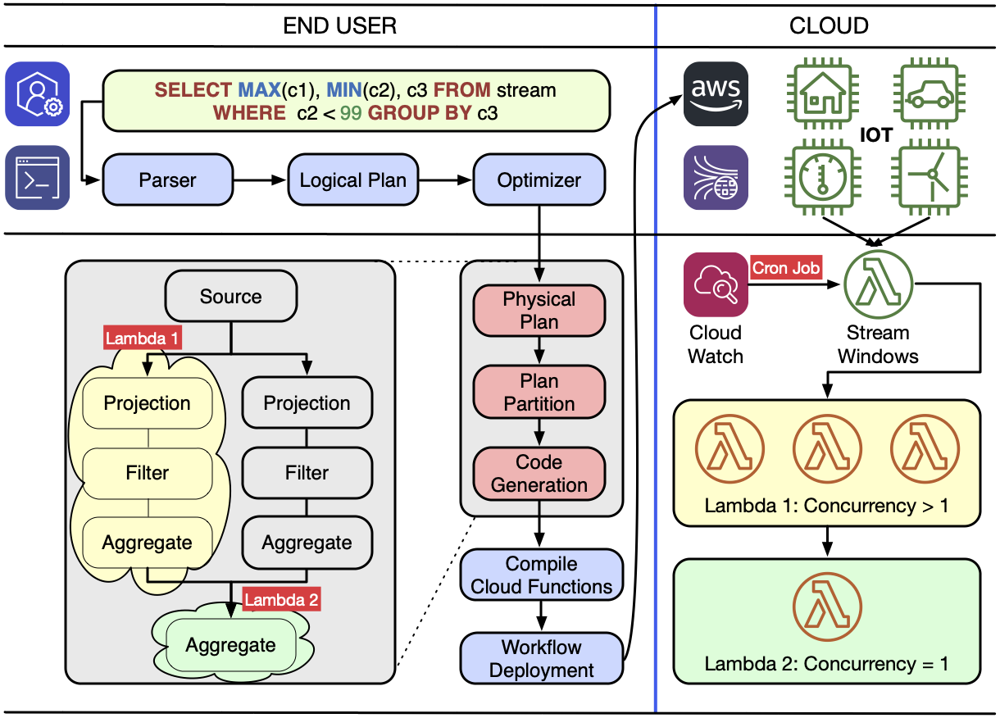

## Squirtle: Serverless SQL Query Engine for Real-Time and Batch Analytics

## Architecture

The following diagram highlights some of the integrations that will be possible with this unique architecture. Note that not all components shown here are available yet.

## License

Copyright (c) 2020-2021 Gang Liao. All rights reserved.
The library, examples, and all source code are released under Apache 2.0.
