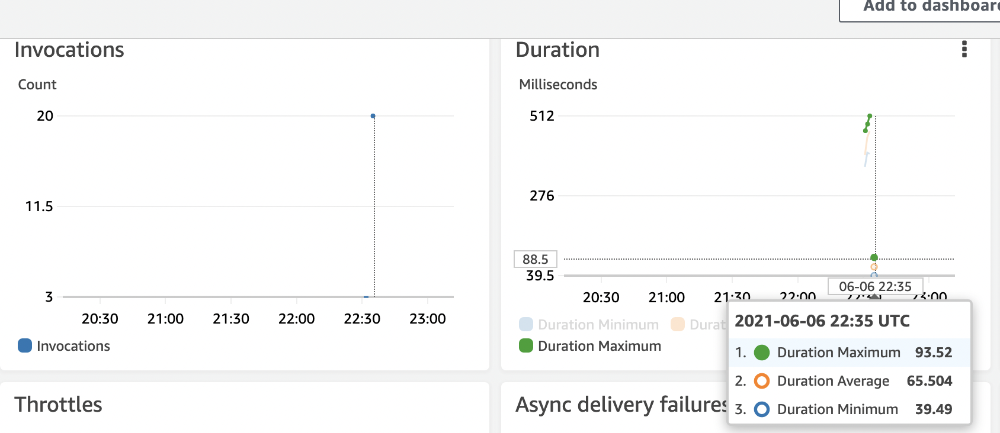

## Flock: A Practical Serverless Streaming Query Engine

[](https://github.com/flock-lab/flock/actions)
[](https://codecov.io/gh/flock-lab/flock)
<a href="https://cla-assistant.io/flock-lab/flock"></a>
[](LICENSE)


The generic lambda function code is built in advance and uploaded to AWS S3.

| Lambda Function Code    | S3 Bucket      | S3 Key           |    S3 URL                        |
| ----------------------- | ---------------| ---------------- | -------------------------------- |
| [Nexmark Benchmark](https://beam.apache.org/documentation/sdks/java/testing/nexmark/)      | umd-flock   |   nexmark        |  https://umd-flock.s3.amazonaws.com/nexmark      |


## Build From Source Code

You can enable the features `simd` (to use SIMD instructions) and/or `mimalloc` or `snmalloc` (to use either the mimalloc or snmalloc allocator) as features by passing them in as --features:

```shell
$ cargo build --target x86_64-unknown-linux-gnu --release --features "arrow/simd datafusion/simd  mimalloc"
```

## Upgrade Cloud Function Services

flock-cli is an interactive command-line query tool for Flock.

```shell
$ cd target/x86_64-unknown-linux-gnu/release/
$ ./flock-cli --help
```

<details>
<summary>
<strong>Output</strong>
</summary>

```shell
Flock 0.1.0
Command Line Interactive Contoller for Flock

USAGE:
    flock-cli [FLAGS] [OPTIONS]

FLAGS:
    -h, --help       Prints help information
    -v               Sets the level of verbosity
    -V, --version    Prints version information

OPTIONS:
    -u, --upload <FILE>    Upload lambda execution code to S3.
    -k, --key <STRING>     AWS S3 key for this function code.
```
</details>
</br>

For example, you can use `flock-cli` in response to the uploading, updating, or deleting of the cloud functions in AWS S3.

```shell
# for example, upgrade the NexMark Benchmark for streaming processing
./flock-cli -u nexmark_lambda -k nexmark
```

<details>
<summary>
<strong>Output</strong>
</summary>

```bash
 /`  
/:y/` `  
`shdhso.  
 -yhddh+.  
  .yhhhy+-  
   .syyhs+/.  
    `+shhs++:.  
     `:syyyo++/.  
       .+ssys+++/-`          `.----.`  
        ./oyyyo+++/:.`     `-/+++/-..`  
          -/osyso++++/:.` -/++/-`  
           .-/osssoo++++/:++++`  
           `.-/++osooo++++++++-  
              `-:/+oooo++++++o/  
                `-:/+o++++++oo-                                `````             `  
                 `.-//++++++o/   `:++:::://   .:++:`        .:///////.       .://///+-   ./++:` .++/.  
                 ``..:+++++o+`     os`   -+     ss        `/+-`//. `-+/`   `+s:`   `o:    `so  `:+-  
                     :+++++/`      os`  --      ss        /o`  `+o`  `++   +s:      ``    `so .+:`  
                   `:+++++:        os:::o/      ss        o/   /+++`  :s   ss.            `ss/so`  
                 .:++++:.`         os`  --      ss     `  /o``+/``o/:`++   +s:      `     `so .oo.  
             `.:/++++/.            os`          ss    :+   /+:-`  .-:+/`   `+s:`    o/    `so  `+s:  
          .-----:/++-            `:++:-       .:++::::+/    .:++//++:.       ./++///+-   .:o+:`  :o/:  
          `.-:::-/:`                                            ``  
        `--.``-/:`  
            .:-`  

Flock: Serverless SQL Query Engine for Real-Time and Batch Analytics (https://github.com/flock-lab/flock)

Copyright (c) 2020-2021, UMD Data System Group. All rights reserved.

▒▒▒▒▒▒▒▒▒▒▒▒▒▒▒▒▒▒▒▒▒▒▒▒▒▒▒▒▒▒▒▒▒▒▒▒▒▒▒▒▒▒▒▒▒▒▒▒▒▒▒▒▒▒▒▒▒▒▒▒▒▒▒▒▒▒▒▒▒▒▒▒▒▒▒▒▒▒▒▒▒▒▒▒▒▒▒▒▒▒▒▒▒▒▒▒▒▒▒▒▒▒▒▒▒▒▒▒▒▒▒▒

============================================
         Upload function code to S3  
============================================


[UPLOAD] ▒▒▒▒▒▒▒▒▒▒▒▒▒▒▒▒▒▒▒▒▒▒▒▒▒▒▒▒▒▒▒▒▒▒... ... ... ...
[OK] Upload Succeed.
```
</details>
</br>

## Nexmark Benchmark

All the following Nexmark queries share the same lambda function code.

| Query    | Name     | Summary  | Flock |
| -------- | -------- | -------- | -------- |
| q0 | Pass Through | Measures the monitoring overhead including the source generator. | ✅ |
| q1 | Currency Conversion | Convert each bid value from dollars to euros. | ✅ |
| q2 | Selection | Find bids with specific auction ids and show their bid price. | ✅ |
| q3 | Local Item Suggestion | Who is selling in OR, ID or CA in category 10, and for what auction ids?  | ✅ |
| q4 | Average Price for a Category | Select the average of the wining bid prices for all auctions in each category. | ✅ |
| q5 | Hot Items | Which auctions have seen the most bids in the last period? | ✅ |
| q6 | Average Selling Price by Seller | What is the average selling price per seller for their last 10 closed auctions. | ✅ |
| q7 | Highest Bid | Select the bids with the highest bid price in the last period. | ✅ |
| q8 | Monitor New Users | Select people who have entered the system and created auctions in the last period. | ✅ |
| q9 | Winning Bids | Find the winning bid for each auction. | ✅ |
| q13 | Bounded Side Input Join | Joins a stream to a bounded side input, modeling basic stream enrichment. | ✅ |

To execute q3 in the Nexmark benchmark, you can use `nexmark_bench` to issue the following command:

```shell
$ ./nexmark_bench --help

flock-benchmarks 0.1.0

USAGE:
    nexmark_bench [FLAGS] [OPTIONS] --query <query>

FLAGS:
    -d, --debug      Activate debug mode to see query results
    -h, --help       Prints help information
    -V, --version    Prints version information

OPTIONS:
    -e, --events_per_second <events-per-second>
            Number of events generated among generators per second [default: 100000]

    -g, --generators <generators>                  Number of threads or generators of each test run [default: 100]
    -q, --query <query>                            Query number
    -s, --seconds <seconds>                        Number of threads to use for parallel execution [default: 10]

$ RUST_LOG=info ./nexmark_bench  --query 3  -g 10 -s 2 --events_per_second 1000 --debug
```

<details>
<summary>
<strong>Output</strong>
</summary>

```bash
Running benchmarks with the following options: NexmarkBenchmarkOpt { query: 3, debug: true, generators: 10, seconds: 2, events_per_second: 1000 }
[2021-06-06T22:35:43Z INFO  nexmark_bench] [OK] Create lambda function arn:aws:lambda:us-east-1:942368842860:function:q3.
[2021-06-06T22:35:43Z INFO  runtime::datasource::nexmark::nexmark] Generating events for 2s over 10 partitions.
[2021-06-06T22:35:43Z INFO  nexmark_bench] [OK] Generate nexmark events.
[2021-06-06T22:35:43Z INFO  nexmark_bench] [OK] Send nexmark event (time: 0, source: 1).
[2021-06-06T22:35:43Z INFO  nexmark_bench] [OK] Send nexmark event (time: 0, source: 2).
[2021-06-06T22:35:43Z INFO  nexmark_bench] [OK] Send nexmark event (time: 0, source: 0).
[2021-06-06T22:35:43Z INFO  nexmark_bench] [OK] Send nexmark event (time: 0, source: 6).
[2021-06-06T22:35:43Z INFO  nexmark_bench] [OK] Send nexmark event (time: 0, source: 4).
[2021-06-06T22:35:43Z INFO  nexmark_bench] [OK] Send nexmark event (time: 0, source: 7).
[2021-06-06T22:35:43Z INFO  nexmark_bench] [OK] Send nexmark event (time: 0, source: 5).
[2021-06-06T22:35:43Z INFO  nexmark_bench] [OK] Send nexmark event (time: 0, source: 8).
[2021-06-06T22:35:43Z INFO  nexmark_bench] [OK] Send nexmark event (time: 0, source: 9).
[2021-06-06T22:35:43Z INFO  nexmark_bench] [OK] Send nexmark event (time: 1, source: 0).
[2021-06-06T22:35:43Z INFO  nexmark_bench] [OK] Send nexmark event (time: 1, source: 1).
[2021-06-06T22:35:43Z INFO  nexmark_bench] [OK] Send nexmark event (time: 1, source: 2).
[2021-06-06T22:35:43Z INFO  nexmark_bench] [OK] Send nexmark event (time: 1, source: 3).
[2021-06-06T22:35:43Z INFO  nexmark_bench] [OK] Send nexmark event (time: 1, source: 4).
[2021-06-06T22:35:43Z INFO  nexmark_bench] [OK] Send nexmark event (time: 0, source: 3).
[2021-06-06T22:35:43Z INFO  nexmark_bench] [OK] Send nexmark event (time: 1, source: 5).
[2021-06-06T22:35:43Z INFO  nexmark_bench] [OK] Send nexmark event (time: 1, source: 6).
[2021-06-06T22:35:43Z INFO  nexmark_bench] [OK] Send nexmark event (time: 1, source: 8).
[2021-06-06T22:35:43Z INFO  nexmark_bench] [OK] Send nexmark event (time: 1, source: 9).
[2021-06-06T22:35:43Z INFO  nexmark_bench] [OK] Send nexmark event (time: 1, source: 7).
[2021-06-06T22:35:44Z INFO  nexmark_bench] Object({"name": String("q3"), "epoch": Number(0), "source": Number(0)})
[2021-06-06T22:35:44Z INFO  nexmark_bench] Object({"name": String("q3"), "epoch": Number(0), "source": Number(1)})
[2021-06-06T22:35:44Z INFO  nexmark_bench] Object({"name": String("q3"), "epoch": Number(0), "source": Number(2)})
[2021-06-06T22:35:44Z INFO  nexmark_bench] Object({"name": String("q3"), "epoch": Number(0), "source": Number(3)})
[2021-06-06T22:35:44Z INFO  nexmark_bench] Object({"name": String("q3"), "epoch": Number(0), "source": Number(4)})
[2021-06-06T22:35:44Z INFO  nexmark_bench] Object({"name": String("q3"), "epoch": Number(0), "source": Number(5)})
[2021-06-06T22:35:44Z INFO  nexmark_bench] Object({"name": String("q3"), "epoch": Number(0), "source": Number(6)})
[2021-06-06T22:35:44Z INFO  nexmark_bench] Object({"name": String("q3"), "epoch": Number(0), "source": Number(7)})
[2021-06-06T22:35:45Z INFO  nexmark_bench] Object({"name": String("q3"), "epoch": Number(0), "source": Number(8)})
[2021-06-06T22:35:45Z INFO  nexmark_bench] Object({"name": String("q3"), "epoch": Number(0), "source": Number(9)})
[2021-06-06T22:35:45Z INFO  nexmark_bench] Object({"name": String("q3"), "epoch": Number(1), "source": Number(0)})
[2021-06-06T22:35:45Z INFO  nexmark_bench] Object({"name": String("q3"), "epoch": Number(1), "source": Number(1)})
[2021-06-06T22:35:45Z INFO  nexmark_bench] Object({"name": String("q3"), "epoch": Number(1), "source": Number(2)})
[2021-06-06T22:35:45Z INFO  nexmark_bench] Object({"name": String("q3"), "epoch": Number(1), "source": Number(3)})
[2021-06-06T22:35:45Z INFO  nexmark_bench] Object({"name": String("q3"), "epoch": Number(1), "source": Number(4)})
[2021-06-06T22:35:45Z INFO  nexmark_bench] Object({"name": String("q3"), "epoch": Number(1), "source": Number(5)})
[2021-06-06T22:35:45Z INFO  nexmark_bench] Object({"name": String("q3"), "epoch": Number(1), "source": Number(6)})
[2021-06-06T22:35:45Z INFO  nexmark_bench] Object({"name": String("q3"), "epoch": Number(1), "source": Number(7)})
[2021-06-06T22:35:45Z INFO  nexmark_bench] Object({"name": String("q3"), "epoch": Number(1), "source": Number(8)})
[2021-06-06T22:35:45Z INFO  nexmark_bench] Object({"name": String("q3"), "epoch": Number(1), "source": Number(9)})
```
</details>
</br>

AWS gives you a personalized view of the status of the query execution (`q3`).



## License

Copyright 2020 UMD Database Group. All Rights Reserved.
The library, examples, and all source code are released under [AGPL-3.0 License](LICENSE).
