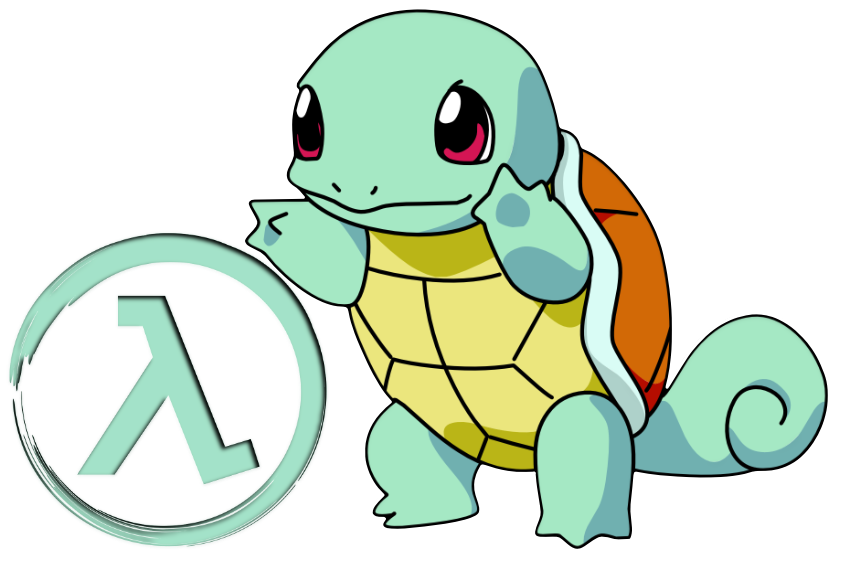

## Squirtle: Serverless SQL Query Engine for Real-Time and Batch Analytics

## License

Copyright 2020 UMD Database Group. All Rights Reserved.
The library, examples, and all source code are released under [Apache License 2.0](LICENSE).
