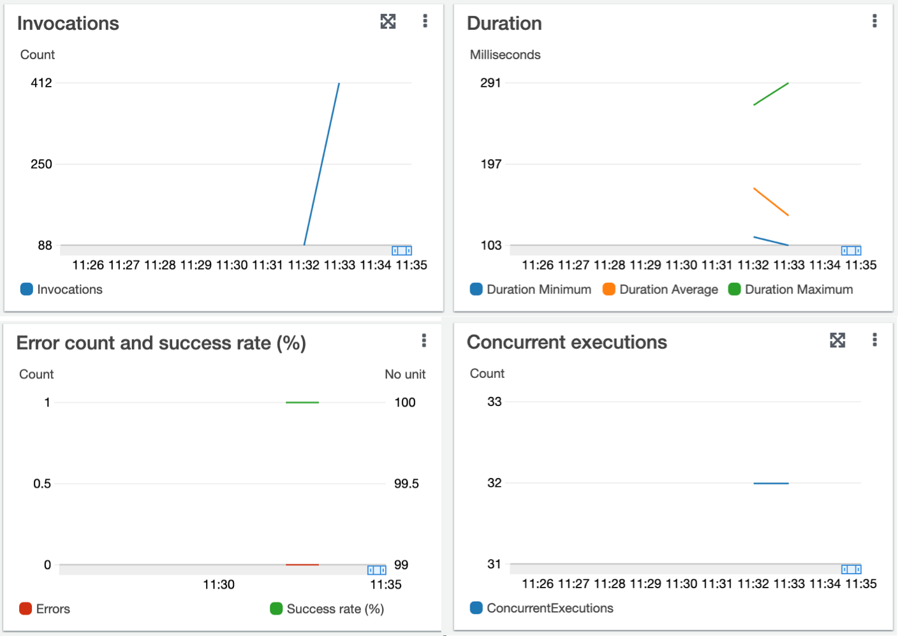

## Playground

Playground module for testing and experimenting with the library. It is not meant to be used in production.
We writes many simplifed examples to evaluate the system design and implementation of Flock.

```shell
[06:32] umd-db.cs.umd.edu:release (code *%) | ./playground --help
flock-playground 0.1.0

USAGE:
    playground [OPTIONS]

FLAGS:
    -h, --help       Prints help information
    -V, --version    Prints version information

OPTIONS:
    -c, --concurrency <concurrency>    Concurrency of the lambda function [default: 8]
    -e, --events <events>              Number of events generated [default: 1000]
    -o, --ops_type <ops-type>          Operation type [default: scatter_gather_ops]
```


## Scatter and Gather Pattern

This module shows how to implement scatter-gather pattern on AWS Lambda. In this example, the source function (concurrency > 1) is a lambda function that sends data packets to a destination function. The destination function (concurrency = 1) is a lambda function that receives data packets from the source function (instances) and aggregates them. The source function and the destination function (instances) are implemented in the different lambda function.

This module includes two lambda functions:

* `flock_pg_scatter`
* `flock_pg_gather`

The client will sends `N` events to the `flock_pg_scatter` function. The `flock_pg_scatter` function sends the events to the `flock_pg_gather` function. The `flock_pg_gather` function receives the events and sums them up.
The ith event contains a integer value `i + 1` where i starts from 0. For example, the first event contains 1, the second event contains 2, and so on.

If we send 100 events to the `flock_pg_scatter` function, the `flock_pg_gather` function will receive 100 events. The sum of the events is 100 * 101 / 2 = 5050. If we send 500 events, the sum of the events is 500 * 501 / 2 = 125250. If we send 800 events, the sum of the events is 800 * 801 / 2 = 320400.

### Example

1. Run an experiment with events = 100, concurrency = 32, and ops_type = scatter_gather_ops.

```text
$ ./playground -e 500 -c 32 -o scatter_gather_ops

Playground with the following options: PlaygroundOpt { ops_type: "scatter_gather_ops", events: 500, concurrency: 32 }
```

<center>
<figure>

<figcaption>Figure 1 - flock_pg_scatter's CloudWatch metrics.</figcaption>
</figure>
</center>

<center>
<figure>

<figcaption>Figure 2 - flock_pg_gather's CloudWatch metrics.</figcaption>
</figure>
</center>

2. Log events

The sum of 1 to 500 is **500 * 501 / 2 = 125250**. Let's parse the logs of the `flock_pg_gather` function, and see what the sum of the events is. In [gather.rs](./scatter_gather_ops/gather.rs), we print the sum of events with UTC time stamp when the function is invoked.

```rust
# gather.rs
println!("{}: {}", Utc::now(), SUM);
```

From the logs, we can see that the sum of the events is **125250**, which means that the sum of the events is correct, and the scatter-gather pattern is working correctly.

```txt
...
2021-11-07 11:34:07.771229756 UTC: 124117
END RequestId: 95012700-456d-43f7-a885-dae43d07e7f8
REPORT RequestId: 95012700-456d-43f7-a885-dae43d07e7f8	Duration: 0.82 ms	Billed Duration: 1 ms	Memory Size: 128 MB	Max Memory Used: 16 MB
START RequestId: 3d086ce8-d83a-470d-b393-705b6522b01c Version: $LATEST
2021-11-07 11:34:07.895078194 UTC: 124611
END RequestId: 3d086ce8-d83a-470d-b393-705b6522b01c
REPORT RequestId: 3d086ce8-d83a-470d-b393-705b6522b01c	Duration: 0.87 ms	Billed Duration: 1 ms	Memory Size: 128 MB	Max Memory Used: 16 MB
START RequestId: acef9223-1603-40a7-878c-aafc50625d21 Version: $LATEST
2021-11-07 11:34:08.899507244 UTC: 125044
END RequestId: acef9223-1603-40a7-878c-aafc50625d21
REPORT RequestId: acef9223-1603-40a7-878c-aafc50625d21	Duration: 0.74 ms	Billed Duration: 1 ms	Memory Size: 128 MB	Max Memory Used: 16 MB
START RequestId: 4b0ce0d7-5f3a-4765-b340-e63099a588c9 Version: $LATEST
2021-11-07 11:34:20.889949412 UTC: 125250
END RequestId: 4b0ce0d7-5f3a-4765-b340-e63099a588c9
REPORT RequestId: 4b0ce0d7-5f3a-4765-b340-e63099a588c9	Duration: 0.67 ms	Billed Duration: 1 ms	Memory Size: 128 MB	Max Memory Used: 16 MB
```
